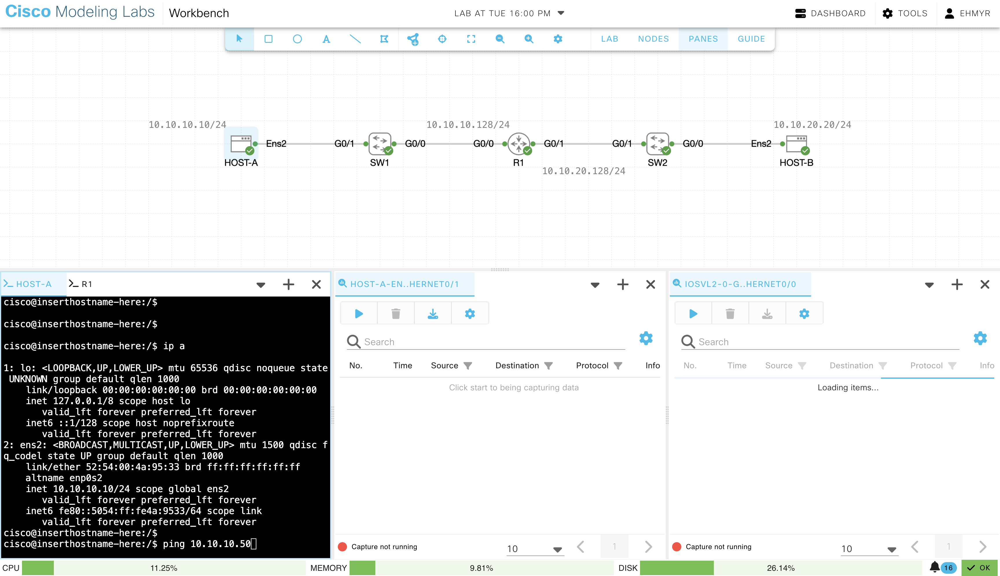
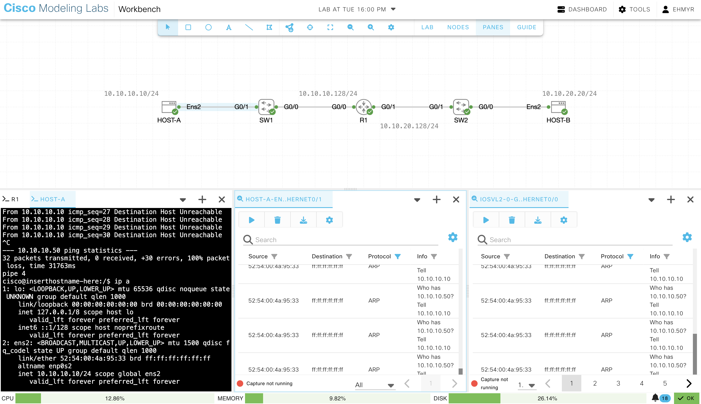
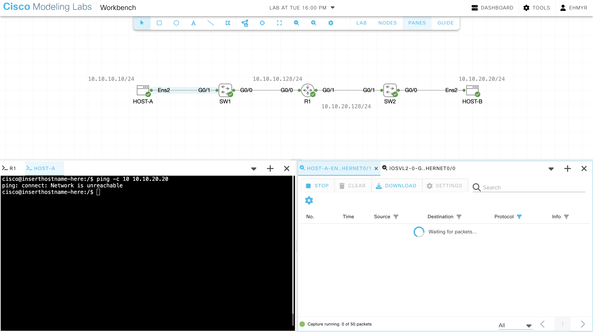
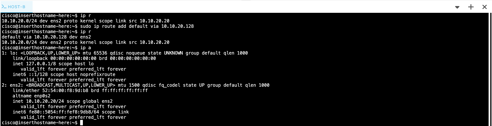
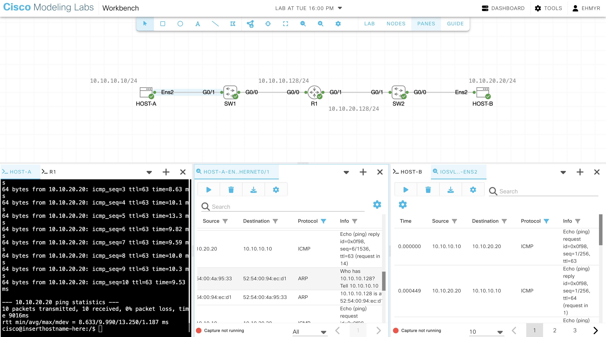
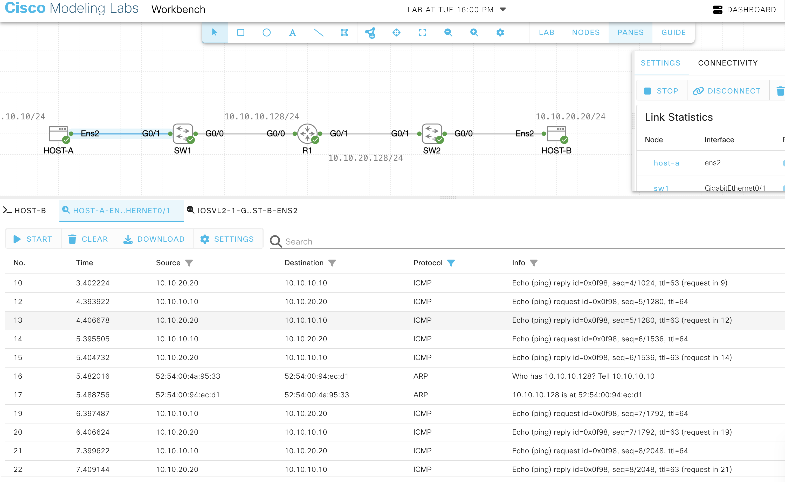
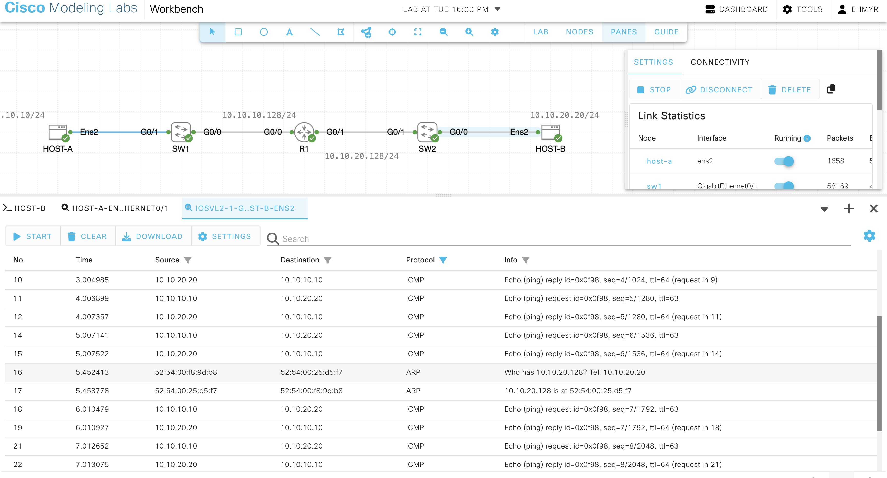

# Default Gateway Failure

## Topology 

This lab consist of 2 Ubuntu host, 2 Switches and 1 router

All hosts have been configured with ip addresses

## Prediction

### When Host A pings 10.10.20.20 what happens if default gateway is missing:

the initial arp request will fail, as there is no default gateway to send the L2 frame.

1. Host A determines that 10.10.20.20 by looking at the network portion of the address; both subnets are using /24. 

2. it needs the default gateway/route, route table answers: where is this going next?

3. No default route, will prevent arp request, as a result the host cannot forward packets because route look up fails

4. No frame is sent SW1

### When Host A pings 10.10.20.20 what happens if default gateway is incorrect:

5. ARP request would be sent only throughout Host A's local Layer-2 broadcast domain/VLAN, the default gateway will not reply to the ARP request if the IP is different to the one configured.

### Behavioural differences: Missing vs Incorrect

6. 

#### Incorrect default gateway
If Host A cannot resolve gateway Mac:

To get to `10.10.20.20` the next hop is > `10.10.10.254`
- A route is present to make L3 forwarding. however when Host A arp's for `10.10.20.254` it will not learn the mac address of the default gateway if nobody responds, L2 frame construction fails. ICMP packet does not get forwarded, but ARP frames do leave Host A and reach SW1.

Observable evidence:

- no default gateway: packets are not forwarded, no packets are traversing the network from Host A

#### Missing default gateway
If Host A has no remote destination:
- With no route for remote destination, selection for next hop cannot occur, subsequently no ARP is sent.

7.

Observable evidence:
- incorrect default gateway: ARP request sent but no reply

## Mental Model

### no default route

ip destination `10.10.20.20`, Host A determines destination is remote by doing a route look up, no next hop is defined, next hop cannot occur, ARP request is not sent. Failure occurs at route lookup.

### default route points to nonexistent 10.10.10.254

ip destination `10.10.20.20`, ost A determines destination is remote by doing a route look up, next hop is defined to be 10.10.10.254, ARP request is sent throughout Host A's local Layer-2 broadcast domain/VLAN, no device replies to ARP request, L2 frame cannot be constructed.

Failure occurs when no device replies to the ARP request.

## CML Build

### No default route

#### link-local
Based on the the packet capture observation, attempting an ping/ICMP request on the same link-local shows that the ARP request leaves Host A and is flooded throughout the network within the broadcast domain, however there is no reply to the ARP request because the IP address does not belong to any device on the same the subnet.

#### remote/not-local
The packet capture observation shows that the ARP request never leaves Host A, with no default gateway defined, the next hop cannot occur resulting in the ARP request not bring sent.

#### Restoration

I added default route to Host A, attempted ping/ICMP request, resulted in 100% packet loss, I inspected the packet capture ARP requests resolved on each broadcast domain. 

After ARP request there was no ICMP requests following this was due to Host B attempting to reconstruct the return path, similar symptom to when Host A did not have a default route:
Echo request could not leave Host A, in Host B Echo request reaches Host B but the reply cannot leave Host B:

The reply from Host B:
Destination: `10.10.10.10`, remote destination

Host B performs a route look up, without default gateway theres no next hop and no ARP request is initiated. 

I inspected Host B, and no default route was set, I added the default route to Host B and attempted the ping/ICMP request. Ping requests/replies succeeded.

I also noticed that during the ICMP transmission, both hosts performed ARP neighbour refreshes for their respective default gateways; the Ethernet destination of the requests was already the gateway's MAC rather than the broadcast MAC, this indicates confirmation/refresh of an existing neighbour entry rather than initial unknown-MAC resolution.

