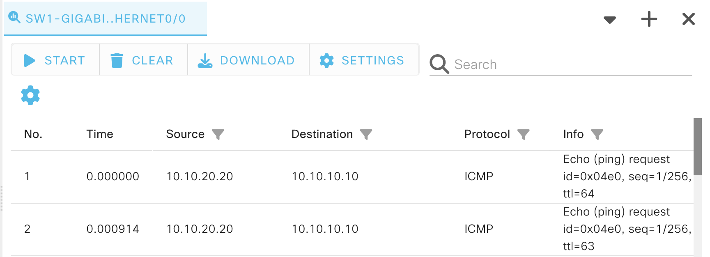
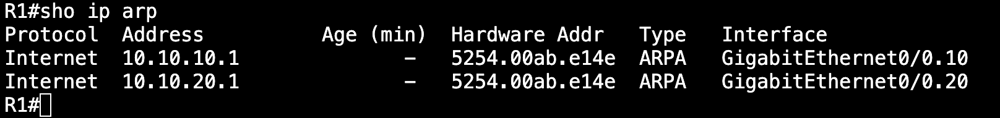
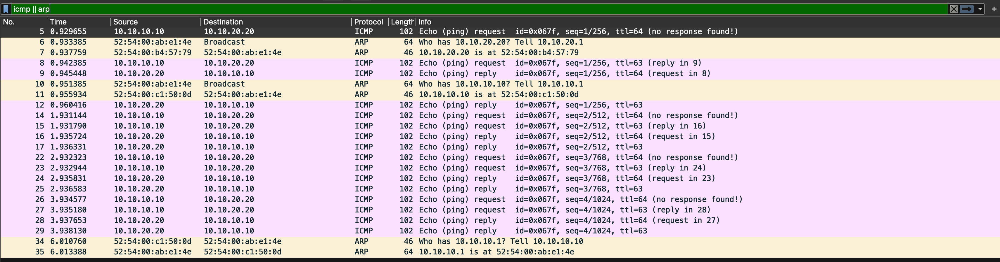
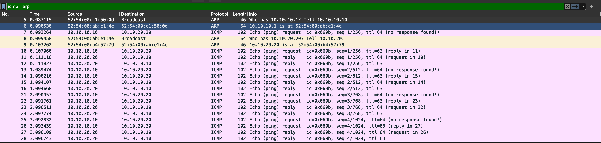

# VLANs, trunks and inter-VLAN routing

Requirement:

Host A VLAN 10
Host B VLAN 20

SW1 must carry both vlan frames to R1 over a single Ethernet Link

R1 must provide L3 path routing between the two networks.

## Host A pings 10.10.20.20

Packet Path Reasoning:

### ARP request

Ethernet source: `52:54:00:c1:50:0d`
Ethernet destination: `FF:FF:FF:FF:FF:FF`

ARP sender IP: `10.10.10.10`
ARP target IP: `10.10.20.20`

Host A > SW1 > R1

`10.10.20.20` belongs to a different network, 
So Host A must send the traffic to the default gateway, the initial ARP request is for `10.10.10.1`.

The frame is sent to SW1.

SW1 > R1

SW1 receives the initial broadcast frame, SW1 learns Host A mac > G0/0

G0/0 is assigned to VLAN 10
G0/1 is assigned to VLAN 20

SW1 broadcasts the frame to swithports within the same vlan as the incoming frame and the trunk port if the vlan is allowed.

Before the frame is sent to the trunk switchport, it is tagged with the VLAN ID of the originating frame's switchport assigned VLAN.

R1 > SW1 > Host A

R1 replies to the ARP request, SW1 learns of R1's ethernet mac address. Forwards frame to Host A

Host A learns `10.10.10.1 > 52:54:00:ab:e1:4e`

### Ping request

IP source: 10.10.10.10
IP destination: 10.10.20.20

Ethernet source: `52:54:00:c1:50:0d`
Ethernet destination: `52:54:00:ab:e1:4e`

Host A > SW1 > R1

ICMP request is encapsulated in a frame and sent to SW1, frame is tagged with 10 and forwarded the default gateway of Host A(sub-interface of R1).

R1  receives VLAN 10 frame > removes L2 encapsulation from frame > inspects IP destination > checks route table, makes routing decision: selects VLAN 20/sub-interface > resolves Host B's MAC if necessary > encapsulates IP packet with a new L2 frame for vlan 20.

R1 > SW1 > Host B

IP source: `10.10.10.10`
IP destination:`10.10.20.20`

Ethernet source: `5254.00ab.e14e`
Ethernet destination: `5254.00b4.5779`

802.1Q VLAN TAG : 20

If R1 ARP cache is empty it will send a ARP request for Host B's mac.

`10.10.20.20` → Host-B-MAC

Then the frame traverses the trunk tagged VLAN 20. When SW1 forwards it onto Host B’s access port, the host-facing transmission is untagged.

## Return Path Host B > Host A

### Host B ARP request

IP source: `10.10.20.20` 
IP destination: `10.10.10.10`

Ethernet source: `52:54:00:b4:57:79`
Ethernet destination: `FF:FF:FF:FF:FF:FF`

This frame came from R1's IP: `10.10.20.1`

For Host B To reply it needs to perform an ARP request and learn the mac address for 10.10.20.1, so a broadcast is sent to SW1, SW1 broadcasts the unicast frame to all active switchports and not assigned in a VLAN. R1 replies. Host B learns R1's mac address.

### Ping request

IP source: `10.10.20.20`
IP destination: `10.10.10.10`

Ethernet source: `52:54:00:b4:57:79` 
Ethernet destination: `52:54:00:ab:e1:4e`

ICMP echo reply is encapsulated in a frame and sent to SW1, the frame is tagged with 20 and forwarded the default gateway of Host B(sub-interface of R1).

R1 receives VLAN 20 frame > removes L2 encapsulation from frame > inspects IP destination > checks route table, makes routing decision: selects VLAN 10/sub-interface > resolves Host A's MAC if necessary > encapsulates IP packet with a new L2 frame for vlan 20.

Key mechanism:
A router remove a frame and encapsulates with the appropriate ethernet frame intended for the next hop. A router works at L2/L3 boundary of a network.

## TTL

The packet capture shows that the TTL decreases from 64 to 63, when R1 routes the packets across each VLAN the TTL decreases by 1. Layer 2 switching and 802.1Q tagging do not decrement TTL.

## What happens if R1 ARP cache is empty?

### only clearing R1's ARP cache

I cleared R1's ARP cache, to test if R1 was actually making ARP requests, based on the packet captures it looked like no ARP requests originated from R2.  

The first test involved clearing R1's arp cache,I rebooted R1 to ensure the dynamic arp entries were cleared:

I Initiated a ping request from Host A to Host B and captured the packets:

Host A already knows how to get to Host B, so when icmp request is sent, R1 routes it to Host B, when the reply comes back to R1, it has to generate an ARP request for 10.10.10.10.

The 1st 4 ARP captures show that R1 is initiating ARP requests to itself. 

### clearing all of the network devices ARP cache

I cleared the arp cache for all the network devices,

I Initiated a ping request from Host A to Host B and captured the packets:

Host A sends arp 10.10.10.1

That ARP request contains:
Sender IP = 10.10.10.10
Sender MAC = 52:54:00:c1:50:0d

When R1 receives that request, R1 has just been told:
10.10.10.10 → 52:54:00:c1:50:0d

R1 can learn Host A's mapping from the request itself.
Then the ICMP Echo Request reaches R1. R1 needs to forward it into VLAN 20, but R1's ARP table is cleared, so now R1 has to send an ARP request for 10.10.20.20. R1 generates its own ARP request.

Host B replies:
10.10.20.20 is at 52:54:00:b4:57:79
Now R1 knows Host B's MAC and forwards the Echo Request.

But there is an additional consequence. R1's ARP request itself contained:
Sender IP = 10.10.20.1
Sender MAC = R1 MAC
Therefore Host B has just seen the gateway mapping:
10.10.20.1 → R1-MAC
So when Host B generates its ICMP Echo Reply, it may not need to ARP for its gateway. It has already learned enough from R1's ARP request.

The deeper logic is:
Does this device need a MAC? Yes, send ARP, or could it already have learned that mapping from earlier ARP traffic?